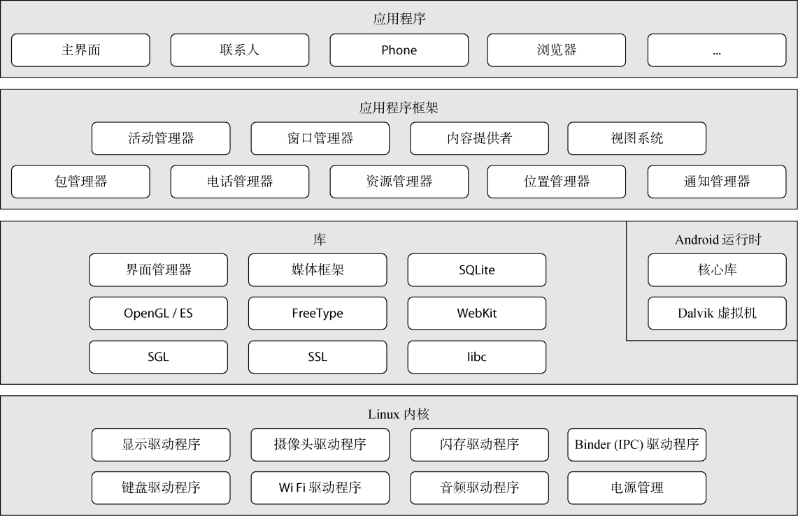

# ***第二章 Android系统架构***
---
&emsp;&emsp;在Android 开发中，迫于开发进度的压力，开发者许多时候都是以项目为导向进行学习，项目需要什么就去了解什么，在实践中不断探索，这虽然是一条捷径，但是充满着潜在的危险，因为项目中用到的知识往往是片面的这让开发者难以对Android 有全面的认识。要想了解Android 相关的安全知识，就需要开发者对Android 系统有一个系统的、全面的认识。

## **2.1 操作系统底层架构**
&emsp;&emsp;Android的系统架构和其操作系统一样，采用了分层的架构。从架构图看，android分为四个层，从高层到低层分别是应用程序层、应用程序框架层、系统运行库层和Linux核心层。

[2-1 基础的Android开发能力]

**2.1.1.应用程序**

&emsp;&emsp;Android会同一系列核心应用程序包一起发布，该应用程序包包括email客户端，SMS短消息程序，日历，地图，浏览器，联系人管理程序等。所有的应用程序都是使用JAVA语言编写的。应用程序是Android系统中直接面向用户的部分。

**2.1.2.应用程序框架**

&emsp;&emsp;开发人员也可以完全访问核心应用程序所使用的API框架。该应用程序的架构设计简化了组件的重用;任何一个应用程序都可以发布它的功能块并且任何其它的应用程序都可以使用其所发布的功能块(不过得遵循框架的安全性限制)。同样，该应用程序重用机制也使用户可以方便的替换程序组件。

&emsp;&emsp;隐藏在每个应用后面的是一系列的服务和系统, 其中包括：

* 活动管理器(Activity Manager)用来管理应用程序生命周期并提供常用的导航回退功能。
* 窗口管理器(Window Manager)负责请求创建窗口和使用窗口，服务端完成窗口的维护，窗口显示等。
* 内容提供器(Content Providers)使得应用程序可以访问另一个应用程序的数据(如联系人数据库)， 或者共享它们自己的数据。
* 丰富而又可扩展的视图系统(Views System)，可以用来构建应用程序， 它包括列表(lists)，网格(grids)，文本框(text boxes)，按钮(buttons)， 甚至可嵌入的web浏览器。
* 包管理服务(PackageManagerService)是Android的系统服务之一,主要功能实现应用包的解析、安装、更新、移动、卸载等服务。
* 电话管理器(Telephone Manager)用于管理手机通话状态，获取电话信息(设备信息、sim卡信息以及网络信息)，侦听电话状态(呼叫状态服务状态、信号强度状态等)以及可以调用电话拨号器拨打电话。
* 资源管理器(Resource Manager)提供非代码资源的访问，如本地字符串，图形，和布局文件(layout files)。
* 位置管理器(Location Manager)提供了一系列与地理位置相关的服务，包括允许应用获取设备的周期性的位置更新；以及接近某个地理位置坐标时触发一个已定义Intent的等。只需要进行一些简单的设置，你的应用程序就可以接受位置更新。
* 通知管理器 (Notification Manager) 使得应用程序可以在状态栏中显示自定义的提示信息。

&emsp;&emsp;有关更多的细节和怎样从头写一个应用程序，请参考 如何编写一个 Android 应用程序。
　　

**2.1.3.系统运行库**

1)程序库

&emsp;&emsp;Android 包含一些C/C++库，这些库能被Android系统中不同的组件使用。它们通过 Android 应用程序框架为开发者提供服务。以下是一些核心库：

* 系统 C 库 - 一个从 BSD 继承来的标准 C 系统函数库( libc )， 它是专门为基于 embedded linux 的设备定制的。
* 媒体库 - 基于 PacketVideo OpenCORE;该库支持多种常用的音频、视频格式回放和录制，同时支持静态图像文件。编码格式包括MPEG4, H.264, MP3, AAC, AMR, JPG, PNG 。
* Surface Manager - 对显示子系统的管理，并且为多个应用程序提 供了2D和3D图层的无缝融合。
* LibWebCore - 一个最新的web浏览器引擎用，支持Android浏览器和一个可嵌入的web视图。
* SGL - 底层的2D图形引擎
* 3D libraries - 基于OpenGL ES 1.0 APIs实现;该库可以使用硬件 3D加速(如果可用)或者使用高度优化的3D软加速。
* FreeType -位图(bitmap)和矢量(vector)字体显示。
* SQLite - 一个对于所有应用程序可用，功能强劲的轻型关系型数据库引擎。

2)Android 运行库

&emsp;&emsp;Android 包括了一个核心库，该核心库提供了JAVA编程语言核心库的大多数功能。

&emsp;&emsp;每一个Android应用程序都在它自己的进程中运行，都拥有一个独立的Dalvik虚拟机实例。Dalvik被设计成一个设备可以同时高效地运行多个虚拟系统。 Dalvik虚拟机执行(.dex)的Dalvik可执行文件，该格式文件针对小内存使用做了优化。同时虚拟机是基于寄存器的，所有的类都经由JAVA编译器编译，然后通过SDK中 的 "dx" 工具转化成.dex格式由虚拟机执行。

&emsp;&emsp;Dalvik虚拟机依赖于linux内核的一些功能，比如线程机制和底层内存管理机制。

**2.1.4.Linux 内核**

&emsp;&emsp;Android 的核心系统服务依赖于 Linux 2.6 内核，如安全性，内存管理，进程管理， 网络协议栈和驱动模型。 Linux 内核也同时作为硬件和软件栈之间的抽象层。

## **2.2 Android系统启动机制**

&emsp;&emsp;Android系统在启动的过程中，会启动一个应包管理服务PackageManagerService，这个服务负责扫描系统中特定的目录，找到里面的应用程序文件，即以Apk为后缀的文件，然后对这些文件进解析（其实就是解析应用程序配置文件AndroidManifest.xml的过程，并从里面得到得到应用程序的相关信息，例如得到应用程序的组件Activity、Service、Broadcast Receiver和Content Provider等信息），得到应用程序的相关信息，完成应用程序的安装过程。

&emsp;&emsp;通过ActivityManagerService这个服务，我们就可以在系统中正常地使用这些应用程序了。

* PackageManagerService负责安装系统的应用程序：

&emsp;&emsp;1. Android系统在启动的过程中，Zygote进程启动SystemServer组件，SystemServer组件启动PackageManagerService服务、ActivityManagerService服务等。

&emsp;&emsp;2. PackageManagerService服务启动过程：创建了一个PackageManagerService服务实例，把这个服务添加到ServiceManager中去（ServiceManager是Android系统Binder进程间通信机制的守护进程，负责管理系统中的Binder对象）。

&emsp;&emsp;3. PackageManagerService类的构造函数中开始执行安装应用程序的过程：调用scanDirLI函数来扫描移动设备上的五个目录中的Apk文件（ /system/framework、 /system/app、 /vendor/app、/data/app、 /data/app-private），对于目录中的每一个文件，如果是以Apk作为后缀名，那么就调用scanPackageLI函数来对它进行解析和安装：

&emsp;&emsp;4. 首先会为这个Apk文件创建一个PackageParser实例，接着调用这个实例的parsePackage函数来对这个Apk文件进行解析（这个函数最后还会调用另外一个版本的scanPackageLI函数把来解析后得到的应用程序信息保存在PackageManagerService中）

&emsp;&emsp;5. 每一个Apk文件都是一个归档文件，它里面包含了Android应用程序的配置文件AndroidManifest.xml，这里主要就是要对这个配置文件解析就行了。从Apk归档文件中得到这个配置文件后，就调用另一外版本的parsePackage函数对这个应用程序进行解析：对AndroidManifest.xml文件中的各个标签进行解析，如application标签的解析，这是通过调用parseApplication函数来进行的。

&emsp;&emsp;6. 解析完成后，一层层返回，调用另一个版本的scanPackageLI函数，把前面解析应用程序得到的package、provider、service、receiver和activity等信息保存在PackageManagerService服务中（保存在mPackages、mActivities、mReceivers、mServices等成员变量(HashMap类型)中）

## **2.3 Android沙箱机制**

&emsp;&emsp;Android 沙箱实现了应用程序的相互隔离，用于对文件系统的实体访问进行控制，也可以对其他Android系统资源进行访问控制。简单的说，每个应用程序无法访问其他应用程序的资源。沙箱系统的原理主要基于Linux系统的UID/GID机制。Android对传统的Linux的UID/GID机制进行了修改。在 Linux 中，一个用户 ID 识别一个给定用户;在 Android 上，一个用户 ID 识别一个应用程序。应用程序在安装时被分配用户 ID，应用程序在设备上的存续期间内，用户 ID 保持不变。权限是关于允许或限制应用程序(而不是用户)访问设备资源。

** 2.3.1 Android ID 映射表(AID) **

** 2.3.2 应用程序 UID **

** 2.3.3 通过UID保护文件资源流程详解 **

## **2.4 Android消息机制**
## **2.5 AndroidWebview机制**
